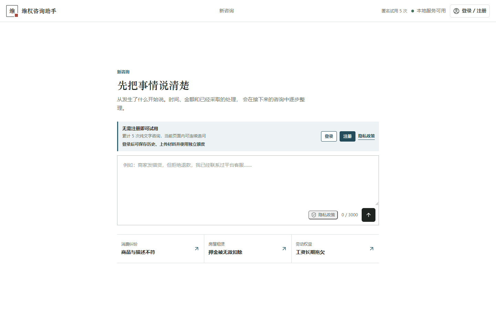
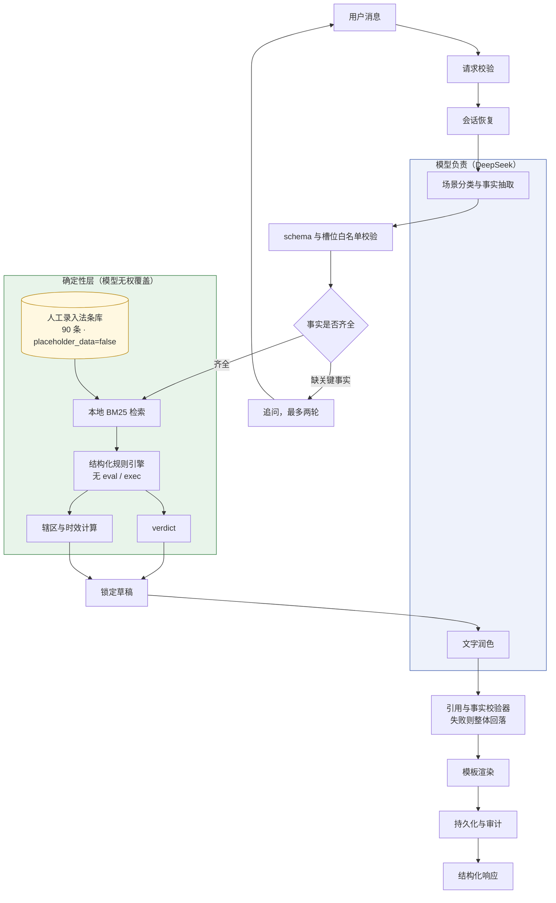
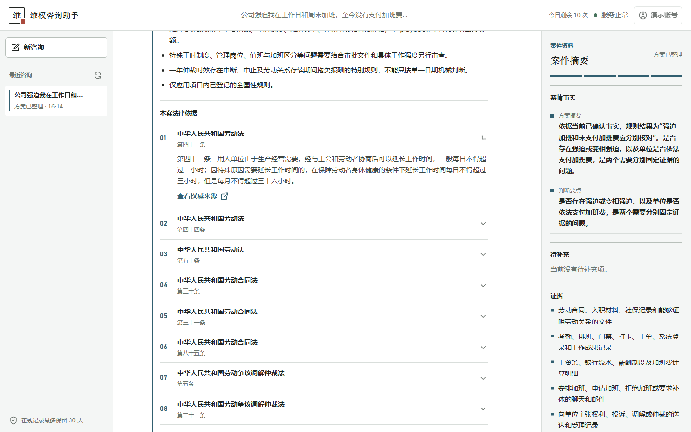
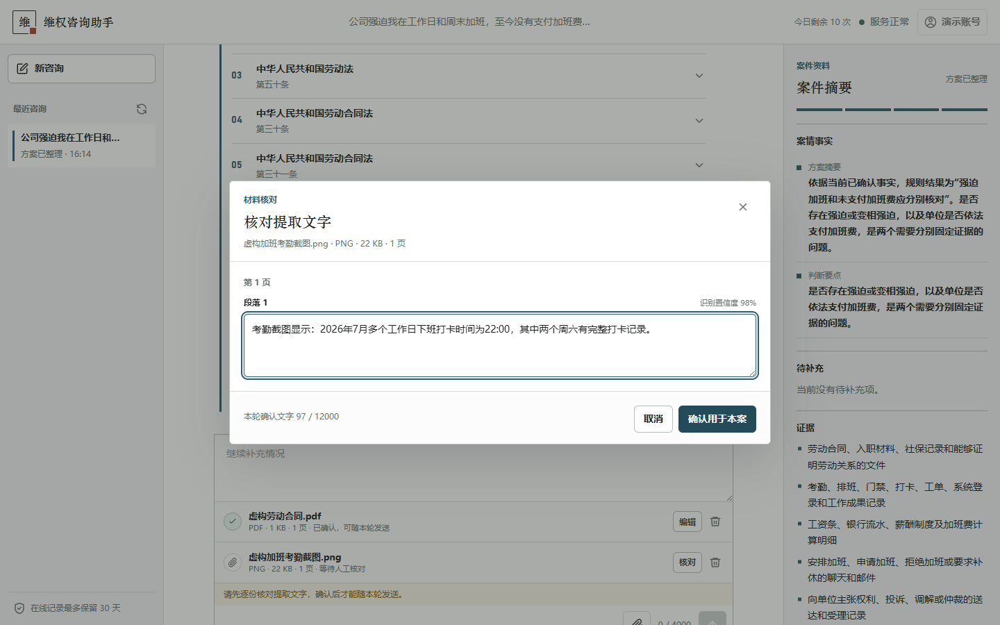

# 维权作战 Agent

把日常纠纷整理为证据固定清单、时效提示和逐步行动方案。

<p>
  <a href="https://github.com/xyl0729/weiquan-agent/actions/workflows/ci.yml"></a>
  <a href="LICENSE"></a>
  
  <a href="https://weiquan.072988.xyz"></a>
</p>

**[立即在线体验](https://weiquan.072988.xyz)** · [快速启动](#快速启动) ·
[系统架构](#架构) · [贡献指南](CONTRIBUTING.md) · [安全政策](SECURITY.md)

无需注册即可进行 5 次纯文字试用；登录后可保存历史、连续追问并上传 PDF 或图片材料。

> 本项目提供信息整理与文书辅助，不构成法律意见，不预测个案结果。

押金被扣、预付卡跑路、退货被拒、加班费不给——这类纠纷里，多数人卡住的地方不是
"不知道自己有理"，而是不知道**先固定哪份证据、时效还剩多久、下一步该找谁**。

这个项目把这件事做成了确定性流水线：法条正文 100% 人工从全国人大法律法规数据库
录入，`verdict` 和时效只由本地规则产出，模型只负责读懂你的话和把已定结论说清楚。
**模型不能生成、也不能覆盖任何一条法律依据。**



## 功能一览

| 模块 | 已实现能力 | 关键边界 |
|---|---|---|
| 咨询与追问 | 同一案件连续追问，每轮携带已确认事实和对话上下文 | 事实不足时追问或升级，不自行补写 |
| 法律依据 | 90 条人工核验法条，附条号、生效日期与全国人大原文链接 | 模型不能生成或覆盖法条 |
| 确定性决策 | 本地规则产出 `verdict`、辖区与时效提示 | 无 `eval`、`exec` 或自由工具循环 |
| 材料处理 | 每轮最多 3 个 PDF/PNG/JPG/JPEG，OCR 后逐页核对确认 | 原文件与未确认文字按临时数据处理 |
| 账号与试用 | 匿名试用、邮箱验证码注册、登录、额度、历史与删除 | 匿名咨询不保存历史，用户数据按所有权隔离 |
| DeepSeek | 生产环境每轮咨询使用真实 DeepSeek，记录脱敏模型元数据 | 失败不静默伪装成 Fake 成功 |
| 生产运维 | PostgreSQL、迁移、加密 OSS 备份、监控、回滚与保留期清理 | 内部指标和数据库不暴露公网 |

## 快速启动

默认使用完全离线的 `FakeProvider`，不需要 DeepSeek Key，也不会发送外部模型请求。
首次安装时长取决于网络，按下面一组命令即可启动。

<details open>
<summary><strong>Windows PowerShell</strong></summary>

```powershell
git clone https://github.com/xyl0729/weiquan-agent.git
cd weiquan-agent
python -m venv .venv
.\.venv\Scripts\python.exe -m pip install -r requirements.txt
.\.venv\Scripts\python.exe scripts\ingest_statutes.py
.\.venv\Scripts\python.exe -m uvicorn app.main:app --reload
```

</details>

<details>
<summary><strong>macOS / Linux</strong></summary>

```bash
git clone https://github.com/xyl0729/weiquan-agent.git
cd weiquan-agent
python3 -m venv .venv
.venv/bin/python -m pip install -r requirements.txt
.venv/bin/python scripts/ingest_statutes.py
.venv/bin/python -m uvicorn app.main:app --reload
```

</details>

打开 [http://127.0.0.1:8000](http://127.0.0.1:8000) 即可使用。需要接入 DeepSeek 时，
再参考[本地联调](#deepseek-本地联调)，真实 Key 只写入未跟踪的 `.env`。

## 它和"问大模型"有什么不同

| | 直接问通用大模型 | 本项目 |
|---|---|---|
| 法条来源 | 模型生成，可能虚构条号 | 人工录入的 90 条官方法条，`placeholder_data=false` |
| 结论产出 | 模型自由发挥 | 本地确定性规则独占 `verdict` |
| 时效计算 | 靠模型推理 | 辖区规则模块计算 |
| 数据不全时 | 照样给个像样的答案 | 停下来追问，或 `escalate`，不补写推测 |
| 可验证性 | 无 | `verify_refs.py` 门禁：每条 playbook 引用必须精确命中本地法条库 |

检索质量当前 `Recall@5 = 1.000 (92/92)`，覆盖 21 个评测分组。

## 输出长什么样

输入一句"房东不退押金"，Agent 先追问关键事实（押金金额、是否约定可扣、退租日期），
补齐后返回结构化方案。下面是真实响应的节选：

**结论**（`verdict`，由本地规则产出，模型无权覆盖）

```json
{
  "code": "need_more_facts",
  "label": "需先核对合同与损坏或欠费证据",
  "rule_ids": ["default_conservative"],
  "key_point": "除正常居住磨损外，欠费、提前解约等证据不足或有争议，需要结合合同和凭证核对。"
}
```

**该先固定哪些证据**

```
1. 租赁合同、补充协议、押金支付凭证
2. 入住与退房时的照片、视频、验收记录
3. 房东说明扣款理由和金额的聊天、短信或书面通知
4. 维修报价、发票、收据和损坏部位对应材料
5. 水电燃气、物业费用结算凭证或协商记录
```

**法律依据**（7 条，均带生效日期和全国人大数据库原文链接）

```
住房租赁条例·第十九条            生效 2025-09-15
  出租人收取押金的，应当在住房租赁合同中约定押金的数额和返还时间以及扣减
  押金的情形。除住房租赁合同约定的情形外，出租人在租赁关系终止后不得扣减押金。
  来源 https://flk.npc.gov.cn/detail?id=ff808181983198da01983f9ff1be5b2c

民法典·第七百一十条              生效 2021-01-01
  承租人按照约定的方法或者根据租赁物的性质使用租赁物，致使租赁物受到损耗的，
  不承担赔偿责任。
  来源 https://flk.npc.gov.cn/detail?id=ff808081729d1efe01729d50b5c500bf

（另 5 条：民法典第七百一十一条、七百一十三条、七百一十四条、七百三十三条，
  住房租赁条例第三十九条）
```

**可直接发出的协商话术**（含发送对象、渠道、发送时机、发送后留痕和升级路径）

```
您好，我就租房押金扣减的问题正式与您书面处理。

已确认信息：问题类型：租房押金扣减；押金总额：2,000 元；被扣或未退金额：
2,000 元；合同是否明确约定该扣减情形：否；发生日期：2026-07-31。

当前就现有押金材料，结论倾向为需先核对合同与损坏或欠费证据。…

请您书面列出扣减的项目依据、合同条款和对应票据；我先确认无争议部分，如不同意
返还，请具体说明理由和证据。
```

响应里还包含 `session_id` / `turn_id` / `audit_id`、辖区判断、时效提示、明确的
能力边界声明，以及脱敏后的模型用量（provider、model、request_id、token 数）。

## 架构



绿色部分完全不经过模型：法条、`verdict`、日期、辖区规则和时效由本地已核验数据和
确定性模块产出。模型只做两件事 —— 读懂用户的话（结果再经 schema 校验），和把已经
定好的结论说得像人话（结果再经引用校验器，不通过就整体回落到模板文案）。

## 当前状态

已上线公测：[weiquan.072988.xyz](https://weiquan.072988.xyz)，包含网页、登录/注册、
匿名试用、注册用户额度、材料上传核对、智能路由和真实 DeepSeek Provider。生产部署、
数据库迁移、加密 OSS 备份和隔离恢复验证均已完成。

额度规则：

- 未登录匿名试用：累计 5 次，仅支持文字咨询，不保存历史。
- 注册并登录：每日 10 次、每月 50 次，可保存历史并使用材料上传。
- 首次试用和注册会要求确认当前隐私政策；CAPTCHA 是否出现由服务端配置决定。

公开服务只允许真实 DeepSeek；`FakeProvider` 仅用于离线测试和本地演示，不能把
Fake 结果当作真实模型调用。

## 真实界面

<table>
  <tr>
    <th>法条正文与权威来源</th>
    <th>上传材料前逐页核对 OCR</th>
  </tr>
  <tr>
    <td></td>
    <td></td>
  </tr>
</table>

## 覆盖的 9 个场景

每个场景都有独立的 playbook（证据清单、追问槽位、确定性规则）和经 `verify_refs.py`
校验的法条引用：

- 租房押金扣减
- 预付卡与预付款纠纷
- 加班工资与劳动报酬
- 退货换货被拒
- 假货与商品欺诈
- 培训服务退费
- 自动续费与默认扣款
- 装修合同违约
- 小额诉讼程序

`app/playbooks/test_scenario.yaml` 仅用于开发测试，不属于正式场景。后续更新法条、
playbook 或评测样本时，必须重新执行人工核验清单和本地数据门禁。

项目不会抓取法条，也不会由模型生成法条正文。

## 工作方式

咨询请求按固定的 14 个阶段执行：

`请求校验 -> 会话恢复 -> playbook 注册表 -> 安全信号 -> 场景与事实抽取 -> 事实校验 -> 最多两轮追问 -> 本地检索 -> 确定性规则 -> 辖区/时效 -> 锁定草稿 -> 模板渲染 -> 持久化 -> 响应`

`FakeProvider` 只用于离线测试，公开服务只暴露并调用真实 DeepSeek。Provider 只负责
从用户消息中分类场景、抽取结构化事实和润色文字；场景和槽位会再次经过本地 schema
校验。法条、引用、日期、辖区规则、时效和 `verdict` 均由本地已核验数据与确定性
模块产生，模型不能生成或覆盖这些字段。

规则只允许有限的结构化节点，不使用 `eval()`、`exec()`、`simpleeval` 或自由工具
调用循环。依赖数据不完整时，流水线会停止或返回 `escalate`，不会补写推测性结论。

## 本地配置与健康检查

快速启动在根目录没有 `.env` 时也会使用安全的离线默认值。需要显式保存本地配置时，
可以从模板创建：

```powershell
if (-not (Test-Path .env)) { Copy-Item .env.example .env }
```

`.env.example` 是不含秘密的配置模板，不需要填写真实 Key。离线运行时确认根目录
`.env` 中为：

```ini
LLM_PROVIDER=fake
DEEPSEEK_API_KEY=
```

服务启动后，在另一个 PowerShell 窗口检查本地依赖：

```powershell
Invoke-RestMethod http://127.0.0.1:8000/health |
    ConvertTo-Json -Depth 5
```

离线模式下 `checks.provider` 应为 `offline`，且不会访问模型网络。

## 网页使用

本地服务启动后直接打开 [http://127.0.0.1:8000](http://127.0.0.1:8000)。

匿名用户可以直接输入问题开始试用；首次提交时按页面提示确认隐私政策。注册账号后，
通过邮箱验证并登录，即可恢复咨询记录、上传最多 3 个 PDF/PNG/JPG/JPEG 材料。材料
会先提取文字，必须由用户核对并确认后才会发送给 Agent；上传材料不会把 OCR 原文
保存到浏览器的 `localStorage`。

生产网页的模型目录只显示 DeepSeek。每次响应都会显示实际 Provider、模型、request
ID 和脱敏用量；DeepSeek 失败时不会静默切换到 Fake。

## 咨询接口

注册用户的 `POST /api/consult` 接受 `session_id`、`message`、`jurisdiction` 和可选的
`attachment_ids`（最多 3 个）。下面的示例先创建会话，再使用返回的 `session_id` 补充
事实：

```powershell
$uri = "http://127.0.0.1:8000/api/consult"

$first = Invoke-RestMethod `
    -Uri $uri `
    -Method Post `
    -ContentType "application/json; charset=utf-8" `
    -Body (@{
        message = "房东不退押金"
    } | ConvertTo-Json)

$second = Invoke-RestMethod `
    -Uri $uri `
    -Method Post `
    -ContentType "application/json; charset=utf-8" `
    -Body (@{
        session_id = $first.session_id
        message = "押金2000元，房东扣2000元，没说明理由，合同也没约定可以扣。"
        jurisdiction = "CN"
        attachment_ids = @()
    } | ConvertTo-Json)

$second | ConvertTo-Json -Depth 20
```

响应包含会话、turn 和审计 ID，以及状态、追问或方案、本地法条引用和脱敏后的模型
用量。业务状态为 `need_more_facts`、`ready` 或 `escalate`。

## DeepSeek 本地联调

真实联调会产生模型调用。只编辑项目根目录下未跟踪的 `.env`，不要把 Key 填入
`.env.example`：

```ini
LLM_PROVIDER=deepseek
DEEPSEEK_API_KEY=你的实际Key
DEEPSEEK_MODEL=deepseek-v4-flash
DEEPSEEK_BASE_URL=https://api.deepseek.com
```

修改后完整停止并重新启动 Uvicorn，再调用 `/health`。`checks.provider` 为
`configured` 表示配置已加载；它不代表已经发起网络请求。随后可以直接运行上一节的
两轮 `/api/consult` 示例完成真实联调。

API 请求体或请求头不得携带模型 Key。显式选择 `deepseek` 但缺少 Key 时会返回脱敏的
配置错误，不会静默回退到 Fake。联调结束后，将 `.env` 中的 `LLM_PROVIDER` 改回
`fake` 并重启服务即可恢复纯离线模式。

## 数据门禁与测试

```powershell
.\.venv\Scripts\python.exe scripts\ingest_statutes.py
.\.venv\Scripts\python.exe scripts\verify_refs.py
.\.venv\Scripts\python.exe scripts\check_recall.py
.\.venv\Scripts\python.exe -m pytest
```

当前验收基线：

- 法条正文、条号、生效日期和来源链接已经人工核对。
- 92 条召回样本满足不少于 50 条的门槛。
- `Recall@5=1.000`，高于 `0.90` 门槛。
- 所有正式 playbook 引用都能精确命中本地法条库。
- 当前 Windows 本地全量验收基线为 `838 passed, 14 skipped`，默认测试过程不发起
  DeepSeek 请求。12 个 skip 是需配置 `TEST_POSTGRES_URL` 的 Postgres 集成测试，
  另 2 个是只在 Bash 环境执行的 shell 语法检查；Linux CI 会提供这些依赖。

pytest 会为每次运行创建工作区内唯一的 `.tmp/pytest-<时间>-<进程>-<随机后缀>`
目录；`.tmp/` 已被 Git 忽略。这样即使上一次运行由提升权限创建了数据库，下一次
普通权限运行也不会尝试删除旧目录。需要指定临时目录时仍可显式传入
`--basetemp`。

## 安全边界

- 真实 DeepSeek Key 只从环境变量或未跟踪的根目录 `.env` 读取。
- `.env`、`data/app.db` 和 `data/statutes.db` 均被 Git 忽略。
- Key、Authorization Header 和完整模型 Prompt 不进入 API 响应、日志、数据库或审计记录。
- 用户消息在写入本地会话库前会清理看似 Key 或 Authorization Header 的内容。
- 模型输出必须通过严格 schema 和场景槽位白名单；本地规则独占 `verdict`。
- 不安装 FAISS、embedding 模型或 LangChain；邮箱认证、服务端会话与 CSRF 防护由
  项目自身实现。

## 生产部署

生产容器和宿主机 Nginx 配置位于 `deploy/compose.production.yml`。部署、冒烟与
回滚必须遵循 `docs/runbooks/deployment-and-rollback.md`；秘密配置只保存在服务器
受控文件 `/etc/weiquan/weiquan.env`，不得写入仓库。备案通过前保持应用只监听
`127.0.0.1:8001`，不要开放 `80/443`；备案通过后先用最新工作区构建新镜像，再
执行迁移、备份校验、健康检查和 Nginx/HTTPS 验收，最后再启用监控定时器。

## 路线图

- 扩充经人工核验的纠纷场景、法条库与检索基准，不以模型生成内容替代核验。
- 增加法条变更发现与人工复核流程，让过期依据更早暴露。
- 完善 API 示例、部署文档和可复现的评测报告。
- 持续加强失败矩阵、隐私隔离、资源上限和可观测性测试。

路线图不代表法律服务承诺。新场景只有在规则、法条、评测样本和人工核验同时完成后
才会进入正式覆盖范围。

## 参与贡献

欢迎提交缺陷、可复现案例、文档改进和新的 playbook 方案。涉及法条或确定性结论的
修改必须附权威来源，并通过引用与召回门禁；请勿在 Issue、日志或测试夹具中提交真实
纠纷材料、个人信息或密钥。完整流程见 [CONTRIBUTING.md](CONTRIBUTING.md)，安全问题请
按 [SECURITY.md](SECURITY.md) 私下报告。

本项目采用 [MIT License](LICENSE)。
