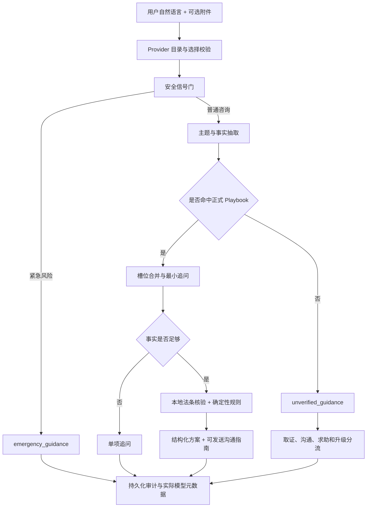

# 智能路由、场景扩展与模型切换设计

## 文档状态

- 日期：2026-08-08
- 版本：v2
- 状态：设计及安全边界修订已获用户确认，待用户复核书面 spec
- 项目目录：`D:\agent development\weiquan-agent`
- 关联基线提交：`625c7ed chore: finalize offline verification workflow`

本文设计三项相互关联的能力：

1. 用户用自然语言描述问题，由 Agent 自动识别主题和关键事实，不再要求用户先从固定场景菜单中分类。
2. 为 15 个高频未覆盖领域增加受限主题识别；在完成本地法条、规则、证据和测试核验前，它们只进入未核验或紧急指导，不作为正式 Playbook。
3. 在页面增加 Fake（离线）与 DeepSeek（真实测试）切换，并让每次响应明确显示实际使用的 Provider 和模型。

## 1. 背景与问题

当前系统已经具备 Playbook 注册表、本地法条数据库、确定性规则、附件证据和会话续问能力，但存在三个直接影响使用的问题：

- 场景识别失败时，流水线会要求用户在租赁、消费、劳动、培训、装修或诉讼程序等旧类别中选择。用户往往不知道应该选什么，且教育、医疗、人身安全等问题无法正确进入处理路径。
- 沟通文字目前是泛化句子，没有明确说明发给谁、通过什么渠道、什么时候发、希望对方做什么，也没有完整正文和发送后的跟进动作。
- Provider 由服务端启动配置决定，页面不能主动切换，也无法让用户确认某一轮是否真的调用了 DeepSeek。Provider 失败时容易让人误以为系统已经完成真实测试。

本次设计把“识别问题”和“输出法律结论”严格分开：模型负责受限的路由、事实抽取和非结论性表达，本地已核验数据与确定性规则负责法律依据、判断、时效、辖区和升级边界。

## 2. 目标

### 2.1 用户目标

- 用户只需描述发生了什么，系统自动识别人物、时间、地点、金额、行为、损害、诉求和风险。
- 系统在已识别主题旁显示简短的识别结果；缺信息时只追问最关键的一项，尽量不要求用户理解法律分类。
- 正式主题生成真正可执行的沟通指南：
  - 发给谁；
  - 使用哪些渠道；
  - 什么时候发送；
  - 想让对方完成什么；
  - 一段填入已确认事实的完整正文；
  - 发送后如何留证、催办和升级；
  - 发送前还必须补充什么。
- 现有已核验纠纷继续使用独立、可核验、可测试的正式 Playbook；新增识别域在核验完成前明确显示为未核验覆盖。
- 用户可以在 Fake 和 DeepSeek 之间切换，并能从响应、历史和审计信息确认实际调用的模型。

### 2.2 系统目标

- 扩大路由注册表，但不允许模型创造未注册的法律场景、法条、规则 verdict 或确定性责任结论。
- 未核验主题仍提供有用的取证、普通沟通、求助和升级建议，但明确标注覆盖边界。
- Provider 选择只接受服务端白名单；Key 永远不进入浏览器、响应、日志或 SQLite。
- 保持现有正式 Playbook、召回基准、附件隔离、会话续问和审计能力的兼容性。
- 15 个新增识别域不得携带正式 Playbook、法条引用或确定性 verdict；未来晋级为正式 Playbook 时必须经过 schema、法条引用和默认保守分支门禁。

## 3. 非目标与明确边界

本次不做以下事情：

- 不承诺预先穷尽现实中所有法律纠纷。法律事实组合是开放集合，长尾主题必须由通用路由识别并进入安全分流。
- 不开放联网法律搜索，也不允许模型自行选择或编造法条。
- 不让模型修改 Playbook verdict、确定性规则、时效、辖区结果或升级条件。
- 不自动替用户提交投诉、报案、仲裁、诉讼或其他法律文件。
- 不在浏览器保存或发送 DeepSeek API Key。
- 不因为 Provider 不可用而静默改用另一个 Provider。
- 不覆盖用户现有的 `.env`、`.env.example` 修改或 `.test-tmp` 内容。

## 4. 已确认的设计决策

### 4.1 路由策略

采用“现有正式主题 + 新增未核验识别域 + 长尾安全分流”：

- 先从自然语言中提取主题和事实；
- 命中正式 Playbook 时执行完整核验流程；
- 识别到但尚未核验的主题时进入 `unverified_guidance`；
- 正在发生的人身危险、未成年人伤害、紧急就医、疑似刑事侵害、诈骗止损或证据即将灭失等信号先走 `emergency_guidance`；
- 未知主题不能回退到旧的九类选择题。

### 4.2 Provider 策略

第一版只提供：

- `fake`：Fake（离线），确定性、无需网络，始终用于自动化测试；
- `deepseek`：DeepSeek（真实测试），只有服务端配置 Key 且 Provider 可用时才可选。

客户端提交 Provider 标识，不提交任意模型名称。服务端返回实际 Provider、模型和请求 ID。

### 4.3 结论权责

- 主题识别、事实槽位抽取和受限话术润色：Provider；
- 法条引用、规则 verdict、证据清单、行动步骤、时效、辖区和升级判断：本地数据与后端代码；
- Provider 的自然语言不能覆盖本地确定性结果。

## 5. 正式覆盖与新增识别域

当前保留的 9 个正式 Playbook：

- `deposit_deduction`：租房押金扣留
- `prepaid_card`：预付卡/储值卡
- `overtime_pay`：加班费
- `return_refused`：退货换货被拒
- `counterfeit_goods`：假货
- `training_refund`：培训退款
- `auto_renewal`：自动续费
- `renovation_default`：装修违约
- `small_claim_procedure`：小额诉讼程序

首批新增的 15 个未核验识别域如下。它们只用于把自然语言问题识别到可读主题，并进入 `unverified_guidance`；命中紧急信号时由安全门提升为 `emergency_guidance`。本阶段不为这些领域创建 YAML Playbook、法条引用、确定性规则或正式 verdict。

| Topic ID | 未核验识别域 | 典型自然语言入口 |
| --- | --- | --- |
| `education_minor_safety` | 教育、未成年人和校园安全 | 老师打骂学生、校园欺凌、学校不处理、未成年人在校受伤 |
| `medical_service_dispute` | 医疗服务纠纷 | 医疗收费、拒绝提供病历、知情同意、诊疗服务争议 |
| `traffic_accident` | 交通事故 | 车辆碰撞、责任争议、保险理赔、维修和人伤 |
| `personal_injury` | 一般人身损害 | 场所摔伤、动物致害、公共区域受伤 |
| `labor_termination` | 劳动合同与解除 | 突然辞退、逼迫离职、未签合同、试用期解除 |
| `wage_social_insurance` | 欠薪与社会保险 | 拖欠工资、少发工资、未缴社保、公积金争议 |
| `workplace_harassment` | 职场骚扰与职场侵害 | 职场侮辱、性骚扰、持续打压、报复性管理 |
| `debt_collection` | 民间借贷、欠款与催收 | 借钱不还、欠条、分期欠款、骚扰式催收 |
| `payment_fraud` | 转账支付与网络诈骗 | 转账被骗、冒充客服、账户被盗、支付争议 |
| `general_rental` | 一般房屋租赁 | 提前退租、维修、涨租、驱逐、转租 |
| `property_neighbor` | 物业与邻里 | 物业不维修、噪音、漏水、停车、公共区域争议 |
| `privacy_reputation` | 隐私、个人信息、名誉和网络骚扰 | 偷拍泄露、人肉、造谣、公开联系方式、网络骚扰 |
| `family_support_property` | 婚姻家庭、抚养与财产 | 抚养费、探望、家庭财产、婚姻关系中的财产争议 |
| `service_contract` | 平台和一般服务合同 | 会员服务、服务未履行、平台规则争议、服务退款 |
| `logistics_travel_food` | 快递、旅游和食品安全消费服务 | 快递损坏、旅行服务违约、食品质量或安全问题 |

这 15 个 Topic ID 与现有 9 个正式场景共同形成路由目录，但只有后者属于正式法律覆盖。一个请求可以带有多个主题线索和风险标志；只要没有精确命中现有正式 Playbook，就必须留在未核验或紧急指导，不得套用名称相近的 Playbook。路由目录不是要求用户选择的菜单。

### 5.1 正式 Playbook 晋级门禁

未来某个新增识别域只有完成本地法条、规则、证据和测试核验后，才能通过独立变更晋级为 `formal`。晋级时新增的 YAML 必须包含并通过现有 `Playbook` schema：

- 唯一版本号、ID、中文名称和别名；
- 仅属于该主题的必填和可选事实槽位；
- 每个必填槽位的单一追问文案；
- 已核验的 `legal_basis`，每一条能在本地法条数据库精确命中；
- 至少一个 `ready` 或 `escalate` 的明确规则分支，以及位于末尾的保守默认分支；
- 证据清单、行动步骤、限制条件和升级条件；
- 时效或辖区信息（仅在本地数据明确支持时声明）；
- 结构化沟通指南模板；
- 正常样本、缺失事实样本、风险样本和边界样本。

本阶段不执行上述晋级。未来新增 Playbook 不得直接把未经核验的网络文章、模型记忆或临时搜索结果写入正式法条库。法条数据集必须记录法律名称、条文号、正文、生效日期和官方来源，并通过数据集的 `placeholder_data: false` 门禁、引用核验脚本和回归测试。

### 5.2 长尾主题行为

当路由器识别出 15 个新增识别域之一，或识别出尚未注册的长尾主题时：

1. 返回可读的主题标签和识别依据摘要；
2. 标记覆盖模式为 `unverified_guidance`；
3. 只询问最能改变下一步的一个事实；
4. 给出立即取证清单、普通沟通建议、可联系的机构类型和升级条件；
5. 提供不作责任断言的沟通正文；
6. 明确哪些内容需要专业人士或主管机构核验；
7. 不返回正式 Playbook 的 verdict、时效结论或不属于当前主题的法条。

如果后续补充事实后精确命中现有 9 个正式 Playbook，系统可以重新路由到对应 Playbook；如果仍属于新增识别域或其他未核验主题，则继续使用安全分流，不能猜测最相近的正式主题。

## 6. 智能路由与数据流



### 6.1 服务端组件边界

保留 `ConsultationPipeline` 作为唯一编排入口，并增加以下职责清晰的边界：

- `ProviderCatalog`：列出白名单 Provider、配置状态、模型名和不可用原因。
- `ProviderResolver`：根据请求中的 `provider_id` 返回已配置的 Provider，拒绝未知标识，不做静默替换。
- `SafetySignalGate`：在普通场景抽取前识别人身危险、未成年人伤害、紧急就医、疑似刑事侵害、诈骗止损和证据灭失信号。
- `TopicRegistry`：保存 Topic ID、显示名称、识别别名、基线覆盖状态和可选 `playbook_id`。现有 9 个正式主题映射到 Playbook；15 个新增识别域的 `playbook_id` 固定为 `null`。
- `ScenarioRouter`：校验 Provider 的候选主题，并由 `TopicRegistry` 和安全门在服务端决定覆盖模式；模型不能自行把主题升级为 `formal`。
- `CommunicationGuideBuilder`：根据已确认事实和 Playbook 模板生成结构化指南，保证正文只使用允许的事实。
- `GuidanceBuilder`：为未核验主题生成不作法律结论的取证、沟通和求助指导。

这些组件通过结构化模型通信，不把任意模型输出直接传递给渲染器或数据库。

### 6.2 请求与 Provider 选择

`ConsultRequest` 增加可选白名单字段：

```json
{
  "session_id": null,
  "message": "老师在课堂上打了学生，学校没有处理",
  "provider_id": "deepseek",
  "jurisdiction": null,
  "attachment_ids": []
}
```

省略 `provider_id` 时使用服务端配置的默认 Provider；显式选择不可用 Provider 时返回明确的 `provider_unavailable` 错误，不自动降级。客户端不能提交任意 `model` 字符串。

`GET /api/providers` 返回：

- Provider ID 和页面显示名称；
- 服务端配置的模型名；
- `available` 状态；
- 不可用时的非敏感原因；
- 是否为离线 Provider；
- 当前服务端默认选择。

Key 是否存在可以用于状态判断，但不能将 Key 内容、完整异常、Authorization Header 或上游原始请求写入响应和日志。

### 6.3 主题与事实抽取契约

Provider 只返回候选抽取结果：

- `candidate_topic_id`：候选 Topic ID 或 `unknown`；
- `topic_label`：用户能看懂的候选主题名称；
- `facts`：正式 Playbook Schema 或通用指导 Schema 允许的候选事实；
- `unknown_slots`：无法从当前消息确认的槽位；
- `risk_flags`：安全风险标志；
- `confidence`：0 到 1 的候选主题置信度。

服务端校验后生成最终路由结果：

- `topic_id`：规范化后的注册 Topic ID 或 `unknown`；
- `scenario_id`：仅在命中正式 Playbook 时设置，否则为 `null`；
- `topic_label`：来自注册表或安全长尾标签的展示名称；
- `coverage_mode`：根据安全信号和 `TopicRegistry` 派生的 `formal`、`unverified_guidance` 或 `emergency_guidance`；
- 经 Schema 过滤的事实、未知槽位和风险标志；
- 实际 Provider、模型、请求 ID 和用量。

服务端必须重新验证：

- `topic_id` 是否属于路由目录，未知值统一按长尾主题处理；
- `scenario_id` 是否由正式 Topic 映射得到，未核验和紧急结果必须为 `null`；
- 正式结果中的 `facts` 是否属于目标 Playbook 的槽位；未核验结果只接受通用指导 Schema 允许的事实；
- 槽位类型、日期、数值、枚举和长度是否符合 schema；
- 风险标志是否触发安全优先级；
- 只有正式结果可以携带引用，且引用必须属于当前 Playbook 白名单。

Provider 不能返回可直接生效的 `coverage_mode` 或 `scenario_id`；如果上游响应夹带这些字段或任意引用，它们都属于不可信输入，服务端必须丢弃并重新派生。低置信度、互相冲突的事实或无法判断的主题不能生成正式法律结论。

### 6.4 正式方案生成

正式路径继续使用现有顺序：

1. 会话恢复或创建；
2. 选择当前 Playbook；
3. 合并并校验事实；
4. 最多两轮单项关键追问；
5. 读取 Playbook 声明的全部强制法条；
6. 执行确定性规则、辖区和时效计算；
7. 锁定方案草稿；
8. 生成沟通指南和证据请求文书；
9. 持久化 turn、审计事件、引用和 Provider 用量；
10. 返回公开响应。

模型不能参与第 5 至第 7 步的结论计算。DeepSeek 的润色只能作用于已经锁定的沟通正文，并且必须通过事实、诉求、引用和限制条件保持不变的校验。

## 7. 可直接使用的话术

### 7.1 结构化模型

`PlanResponse` 增加 `communication_guide`，结构为：

```json
{
  "recipient": "学校校长或年级负责人",
  "channels": ["学校官方邮箱", "校务平台", "当面提交并要求签收"],
  "when_to_send": "整理好事件时间、地点和现有证据后立即发送",
  "objective": "要求学校书面确认已收到投诉，并说明调查和保护措施",
  "message": "您好，我想正式反映……",
  "after_sending": [
    "保存发送页面、邮件回执或签收凭证",
    "记录对方回复时间和具体处理内容"
  ],
  "escalation": [
    "在约定期限内没有书面回应时，向上级教育主管部门求助",
    "出现正在发生的人身危险时，先联系紧急求助渠道"
  ],
  "required_before_send": []
}
```

字段约束：

- `recipient` 必须说明对象身份，不只写“对方”；
- `channels` 至少给出一个实际渠道；
- `when_to_send` 必须与时效或证据状态相关；
- `objective` 必须是可执行请求；
- `message` 是完整正文，不是写作提示；
- `after_sending` 和 `escalation` 至少各有一项；
- `required_before_send` 只列出真正缺失且会改变正文的事实。

前端分成“怎么用”“直接发送”“发送后”三个可扫描区域。复制按钮保留为辅助操作；当 `required_before_send` 非空时，先显示一个明确的补充入口，补齐后自动重新生成正文。

### 7.2 事实与模板安全

正式模板只允许引用：

- 当前 Playbook 已声明的槽位；
- 经用户消息或附件确认的事实；
- 服务端生成的日期、金额和非法律元数据。

模板不得自行补充姓名、身份、日期、金额、损害程度、责任结论、法条编号或对方已经承诺的事项。未知值必须触发单项追问或以明确的待补信息呈现，不能用看似真实的示例值。

对于 `unverified_guidance`，正文只能使用中性表述，例如“请核实并书面说明”“请确认收到并告知处理时间”，不能写成“你已经违法”或“你一定可以获得某项赔偿”。

## 8. 未核验主题与安全处理

### 8.1 普通未核验主题

公开响应增加 `coverage` 和 `guidance` 两个结构化对象，并扩展 `turn_kind`：

- `turn_kind="unverified_guidance"`：识别到主题但尚无正式 Playbook；必须有 `guidance`，不得有正式 `plan` 或 `verdict`；
- `turn_kind="emergency_guidance"`：命中紧急风险；必须先有安全行动和求助路径，不等待普通分类；

- `coverage.mode`：正式、未核验或紧急；
- `coverage.topic`：识别出的主题；
- `coverage.confidence`：识别置信度；
- `coverage.playbook_id`：正式主题 ID，未核验或紧急指导时为 `null`；
- `coverage.notice`：覆盖边界说明；
- `guidance.evidence_now`：立即保存的材料；
- `guidance.actions`：普通沟通和求助动作；
- `guidance.communication_guide`：中性可发送正文；
- `guidance.limitations`：需要核验的事项；
- `guidance.next_question`：最多一个关键补充问题。

兼容现有 `status` 值：普通未核验指导使用 `escalate` 或 `need_more_facts`，具体由是否存在紧急升级条件决定；紧急指导固定为 `escalate`。这两个新 `turn_kind` 只描述展示路径，不新增法律 verdict。

### 8.2 紧急风险

安全门优先识别以下信号：

- 正在发生的人身危险、暴力或威胁；
- 未成年人正在遭受伤害或无法自救；
- 可能涉及刑事侵害、诈骗转账或证据即将灭失；
- 需要立即就医或保护现场的情况。

紧急响应必须先给出停止危险、就医、报警、联系监护人或主管机构等行动顺序，并明确“不要为了取证继续置身危险”。仅使用项目已核验的机构信息；缺少本地号码时显示通用紧急求助建议，不猜测具体联系方式。

## 9. Provider 切换与会话隔离

- Provider 选择按请求生效，下一轮可以手动切换。
- 会话事实、Playbook 和历史方案属于案件上下文，不因切换而清空。
- 每个 turn 保存实际 Provider、模型、请求 ID、用量和错误类别。
- Provider 返回的事实必须经过同一套后端校验；切换不能让模型直接覆盖已确认事实。
- Fake 不调用网络；DeepSeek 只在用户选择且服务端确认可用时发起请求。
- 选择 DeepSeek 但 Key 缺失、上游超时或响应不合规时，前端显示可操作错误，保留当前案件状态，允许用户手动改选 Fake。
- 不将模型选择当作法律结论的一部分；同一组事实的确定性规则结果应保持一致。

## 10. 错误处理矩阵

| 情况 | 服务端行为 | 用户看到的结果 |
| --- | --- | --- |
| Provider ID 不在白名单 | 拒绝请求，不调用模型 | “模型选择无效，请重新选择” |
| Provider 未配置 | 返回 `provider_unavailable` | 显示缺少配置，不自动切换 |
| Provider 网络或上游错误 | 记录安全错误类别，保留会话事实 | 显示重试或手动切换 |
| Provider JSON 不合规 | 丢弃该输出，最多按有限策略重试一次；每次请求都计入用量和审计 | 失败后显示无法可靠解析 |
| 主题未注册 | 不套用相近 Playbook | 返回未核验指导 |
| 关键事实缺失 | 不生成正式结论 | 只追问一项关键信息 |
| 法条引用缺失或数据库门禁失败 | fail closed | 只返回取证和求助路径 |
| 附件识别不确定 | 不把内容写入已确认 facts | 标注待核验并请求人工确认 |
| 紧急风险 | 跳过普通分类等待 | 先显示紧急行动和求助路径 |
| 持久化失败 | 不返回半成品方案 | 返回安全应用错误并记录失败审计 |

错误响应和日志只包含可诊断的错误代码、阶段和非敏感上下文，不包含 Key、Authorization Header、完整上游请求或未经必要处理的个人敏感材料。

## 11. 测试与验收

### 11.1 单元测试

- 现有 9 个正式 Playbook 均能被注册表加载，ID、别名和槽位无冲突。
- 15 个新增 Topic ID 均可识别，固定映射到 `unverified_guidance` 且 `playbook_id=null`，紧急信号可以优先改为 `emergency_guidance`。
- 每个正式 Playbook 的每个规则分支至少有一个正例和一个边界例。
- 每个 `legal_basis` 精确命中本地法条，生效日期、来源和数据库元数据通过门禁。
- 模板只能引用声明槽位，并拒绝未确认事实和非法占位路径。
- 路由器能识别中文自然表达、同义词、错别字和组合事实。
- 新增识别域、未知主题、低置信度、事实冲突和安全风险分别进入预期模式。
- 未核验和紧急结果不包含正式 `plan`、`verdict`、Playbook 法条或时效结论。

### 11.2 API 与 Provider 集成测试

- `GET /api/providers` 正确返回 Fake、DeepSeek 的配置状态和默认选择。
- `POST /api/consult` 接受合法 `provider_id`，拒绝任意模型名和未知 Provider。
- Fake 全流程离线完成，且网络客户端未被调用。
- DeepSeek 真实联调只使用最小样本，响应中的 `usage.provider`、`usage.model` 和 `request_id` 与实际调用一致。
- DeepSeek 不可用或失败时没有 Fake 请求、没有案件状态覆盖、没有 Key 泄露。
- 同一会话切换 Provider 后 facts、scenario 和本地规则结果保持一致且可追溯。

### 11.3 端到端场景验收

至少验证以下输入：

- “老师打骂学生，学校也不处理”自动识别教育与未成年人主题，并进入未核验或紧急指导；
- “公司突然通知我不用来了”自动识别劳动解除主题并进入未核验指导；
- “物业一直不修漏水”自动识别物业与邻里主题并进入未核验指导；
- “我被陌生客服骗着转账”先识别支付/诈骗风险并给出止损动作；
- 一个未注册的长尾主题得到明确的未核验指导，不出现旧分类菜单和虚构法条；
- 现有正式 Playbook 生成的沟通正文包含收件对象、渠道、发送时机、完整正文和发送后动作；
- 未核验主题生成中性沟通正文，不包含确定违法、责任或赔偿断言。

### 11.4 回归门禁

- 保留现有 330 条基线测试的通过要求；
- 保留现有召回基准，并为 15 个新增识别域增加自然语言路由样本；
- 运行现有正式 Playbook 引用校验、规则测试、API 烟测和前端交互验收；
- 仅在 DeepSeek Key 已配置时运行真实联调；未配置时测试必须明确标记为未执行，不得用 Fake 冒充。

## 12. 兼容性与发布顺序

实施按以下顺序进行：

1. 扩展 Provider 目录、请求字段和公开状态接口；
2. 增加路由结果、未核验指导和安全门的数据模型；
3. 重构未知主题路径，删除旧的固定分类追问；
4. 扩展沟通指南模型、模板渲染和前端展示；
5. 加入 15 个未核验 Topic 注册项、识别规则和安全指导模板，不新增正式 Playbook 或法条；
6. 补充路由、规则、引用、Provider 切换和端到端测试；
7. 运行完整离线门禁；只有用户明确选择且服务端确认 DeepSeek 可用时，才做一次最小真实联调；
8. 启动服务并通过浏览器验证模型切换、自然语言路由和话术可用性。

请求中的 `provider_id` 采用可选字段，旧客户端省略该字段时继续使用服务端默认 Provider。已有会话和历史响应保持可读；新响应通过可选结构化字段增加覆盖模式和沟通指南，不改变已有正式 Playbook 的法条和确定性规则语义。

## 13. 完成标准

本次工作只有同时满足以下条件才算完成：

- 用户不需要先选择旧场景类别；自然语言问题能进入现有正式 Playbook、15 个新增识别域或明确的长尾安全分流；
- 15 个新增识别域均保持 `playbook_id=null`，不会返回未经核验的法条、规则、正式 plan 或 verdict；
- 新增识别域和未核验长尾问题都有可执行但不作确定法律结论的安全分流；
- 紧急风险优先返回停止危险、就医、报警或求助等行动，不等待普通分类；
- 正式方案中的话术能够明确告诉用户“发给谁、在哪里发、何时发、发什么、发后做什么”；
- Fake 与 DeepSeek 可在页面切换，响应和审计能证明实际调用的 Provider；
- 不存在自动静默降级、跨场景污染、虚构事实、虚构法条或 Key 泄露；
- 完整测试和启动后的浏览器验收通过。
